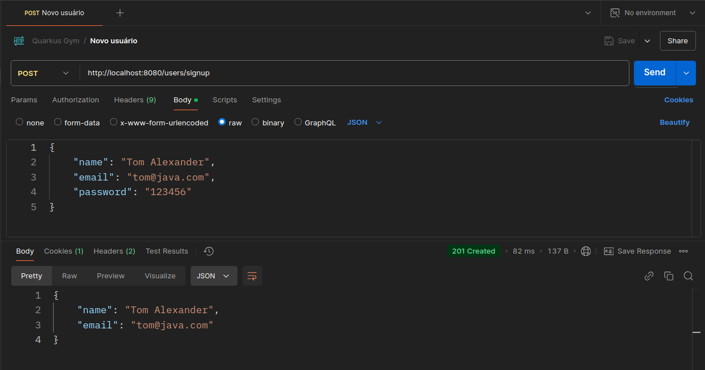
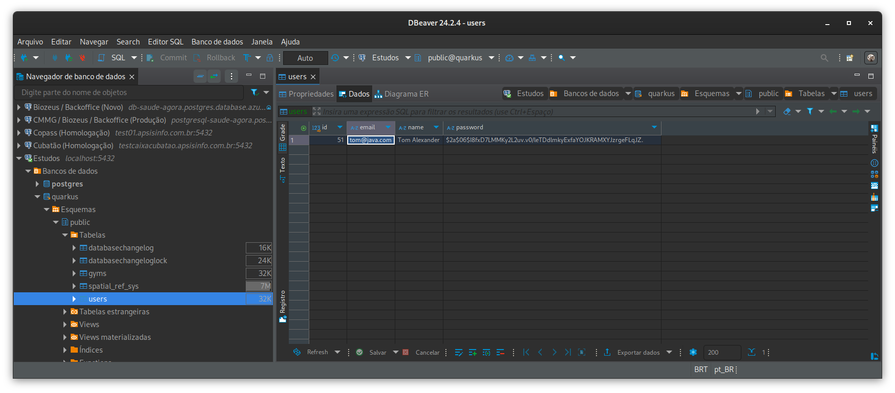

## Fluxo de orientação a objetos

- Arquitetura em uso: [Layered Architecture](https://www.baeldung.com/cs/layered-architecture)

### 1. Crie uma classe do objeto
- Defina a classe que representará o objeto.
- Adicione os atributos necessários.

```java
@Entity
@Cacheable
@Table(name = "users")
public class User extends PanacheEntityBase {
  
  @Id
  @GeneratedValue(strategy = GenerationType.UUID)
  private UUID id;

  @Column
  @NotNull
  private String name;

  @Column
  @NotEmpty
  private String email;

  @Column
  @NotNull
  private String password;

  @Enumerated(EnumType.STRING)
  @Column
  @NotNull
  private Role role;
  
  // Getters & Setters
}
```

### 2. Crie um repositório
- Defina os super métodos para acessar e manipular os dados no banco de dados.

```java
public interface UserRepository {
    Uni<User> findById(Long id);
    Uni<User> findByName(String name);
    Uni<User> findByEmail(String email);
    void create(User user);
}
```

### 3. Gerencie a transação com o banco de dados
- Na pasta `transactions`, implemente classes para gerenciar transações específicas.

```java
// Importações

@ApplicationScoped
public class UserTransactions implements PanacheRepository<User>, UserRepository {

  @Override
  public Uni<User> findByEmail(String email) {
    return find("email", email).firstResult();
  }

  @Override
  public Uni<User> create(User user) {
    return getSession().chain(session -> session.merge(user));
  }
  
  // Outras transações
}
```

### 4. Crie um erro/execessão customizada


- Retornando a pasta `services`, crie uma subpasta chamada `errors` para referir-se a erros que não condiz com a lógica de negócios

```java
public class UserExistsException extends RuntimeException {
  public UserExistsException(String msg) {
    super(msg);
  }
}
```

### 5. Implemente a lógica de negócios
- Crie uma classe de serviço na pasta `services/user`
- Utilize o repositório para acessar os dados

```java
// Importações

@ApplicationScoped
public class UserRegisterService {
  private final UserTransactions service;

  @Inject
  public UserRegisterService(UserTransactions service) {
    this.service = service;
  }
  
  @WithTransaction
  public Uni<User> create(String name, String email, String password, Role role) {
    String passwordHash = BCrypt.withDefaults().hashToString(6, password.toCharArray());

    return service.findByEmail(email)
      .onItem().ifNotNull().failWith(
        new UserExistsException("Este usuário já está cadastrado!"))
      .onItem().ifNull()
      .switchTo(() -> {
          UUID userId = UUID.randomUUID();
          User newUser = new User(userId);

          newUser.setName(name);
          newUser.setEmail(email);
          newUser.setPassword(passwordHash);
          newUser.setRole(role);

          return service.create(newUser);
        }
      );
  }
}
```

### 6. Crie uma fábrica para instanciar o serviço

- Na pasta `factories`, crie uma fábrica para instanciar e configurar o serviço e o repositório

```java
@ApplicationScoped
@SuppressWarnings("unused")
public class UserFactory {
  public UserRegisterService registerService(UserTransactions registerUser) {
    return new UserRegisterService(registerUser);
  }

  // Outras instâncias de serviço
}
```

### 7. Valide os dados
- Na pasta `validations`, crie um record para validar os dados na interação da API. 

> Neste arquivo, é onde se manipula requisição e resposta da API como no exemplo abaixo em que a senha cadastrada é oculta na resposta JSON. Equivalente ao famoso DTO

```java
@Schema(name = "Registro de usuário")
public record UserRegisterValidation (
  @NotNull
  @Schema(description = "Nome do novo usuário")
  String name,

  @Email
  @NotNull
  @Schema(description = "E-mail do novo usuário")
  String email,

  @NotNull
  @Size(min = 6)
  @JsonProperty(access = Access.WRITE_ONLY)
  @Schema(description = "Senha do novo usuário")
  String password,

  @NotNull
  @Schema(description = "Cargo do novo usuário")
  Role role
) {}
```

### 8. Defina a rota da API
- Na pasta `routes`, crie uma classe para definir as rotas e lidar com as requisições e respostas

```java
@Path("/users")
@RegisterRestClient
@Tag(name = "Rota de registro de novos usuários")
public class UserRegisterRoute {
  private static final Logger log = LoggerFactory.getLogger(UserRegisterRoute.class);

  @Inject
  UserRegisterService database;

  @POST
  @Path("/signup")
  @Consumes(MediaType.APPLICATION_JSON)
  @Produces(MediaType.APPLICATION_JSON)
  public Uni<Response> createUser(@Valid UserRegisterValidation request) {
    return database.create(
        request.name(),
        request.email(),
        request.password(),
        request.role()
      ).onItem()
      .transform(newUser -> {
        log.info("Usuário \"{}\" registrou-se na aplicação!", newUser.getName());

        UserRegisterValidation response = new UserRegisterValidation(
          newUser.getName(),
          newUser.getEmail(),
          newUser.getPassword(),
          newUser.getRole()
        );

        return Response.status(CREATED).entity(response).build();
      }).onFailure(UserExistsException.class)
      .recoverWithItem(
        error -> Response.status(CONFLICT)
          .entity(
            error.getMessage()
          ).build());
  }
}
```

### 9. Realize a requisição no Postman

- Teste o endpoint da API com Postman, Insomnia, ThunderClient ou cURL para checar o serviço de registro de novos usuários



### 10. Verifique a persistência dos dados (opcional)

- Instale o DBeaver Community ou pgAdmin e verifique os dados no esquema padrão `public` da base de dados

